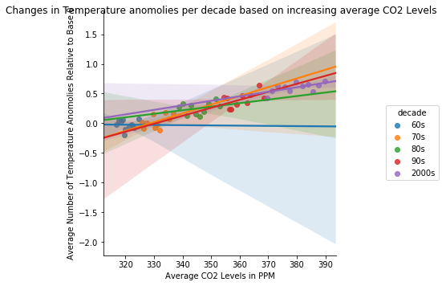

```python
#imports panda as pd
import pandas as pd
```


```python
#imports seaborn as sns
import seaborn as sns
```


```python
#import numpy
import numpy as np
```


```python
#reading my file
climate = pd.read_csv ("Climate.csv")
```


```python
#View
print(climate)
```

        Year  Global Population Size  Average CO2 Levels in PPM  \
    0   1960              3033212527                     316.91   
    1   1961              3090305279                     317.64   
    2   1962              3149244245                     318.45   
    3   1963              3210271352                     318.99   
    4   1964              3273670772                     319.62   
    5   1965              3339592688                     320.04   
    6   1966              3408121405                     321.38   
    7   1967              3479053821                     322.16   
    8   1968              3551880700                     323.04   
    9   1969              3625905514                     324.62   
    10  1970              3700577650                     325.68   
    11  1971              3775790900                     326.32   
    12  1972              3851545181                     327.45   
    13  1973              3927538695                     329.68   
    14  1974              4003448151                     330.18   
    15  1975              4079087198                     331.11   
    16  1976              4154287594                     332.04   
    17  1977              4229201257                     333.83   
    18  1978              4304377112                     335.40   
    19  1979              4380585755                     336.84   
    20  1980              4458411534                     338.75   
    21  1981              4537845777                     340.11   
    22  1982              4618776168                     341.45   
    23  1983              4701530843                     343.05   
    24  1984              4786483862                     344.65   
    25  1985              4873781796                     346.12   
    26  1986              4963633228                     347.42   
    27  1987              5055636132                     349.19   
    28  1988              5148556956                     351.57   
    29  1989              5240735117                     353.12   
    30  1990              5330943460                     354.39   
    31  1991              5418758803                     355.61   
    32  1992              5504401149                     356.45   
    33  1993              5588094837                     357.10   
    34  1994              5670319703                     358.83   
    35  1995              5751474416                     360.82   
    36  1996               583156502                     362.61   
    37  1997              5910566295                     363.73   
    38  1998              5988846103                     366.70   
    39  1999              6066867391                     368.38   
    40  2000              6145006989                     369.55   
    41  2001              6223412158                     371.14   
    42  2002              6302149639                     373.28   
    43  2003              6381408987                     375.80   
    44  2004              6461370865                     377.52   
    45  2005              6542159383                     379.80   
    46  2006              6623847913                     381.90   
    47  2007              6706418593                     383.79   
    48  2008              6789771253                     385.60   
    49  2009              6873741054                     387.43   
    50  2010              6958169159                     389.90   
    
        Average Number of Temperature Anomolies Relative to Base 0  \
    0                                               -0.02            
    1                                                0.05            
    2                                                0.03            
    3                                                0.06            
    4                                               -0.20            
    5                                               -0.10            
    6                                               -0.05            
    7                                               -0.02            
    8                                               -0.07            
    9                                                0.07            
    10                                               0.02            
    11                                              -0.09            
    12                                               0.01            
    13                                               0.15            
    14                                              -0.07            
    15                                              -0.02            
    16                                              -0.11            
    17                                               0.18            
    18                                               0.07            
    19                                               0.17            
    20                                               0.27            
    21                                               0.33            
    22                                               0.13            
    23                                               0.30            
    24                                               0.15            
    25                                               0.12            
    26                                               0.19            
    27                                               0.33            
    28                                               0.41            
    29                                               0.29            
    30                                               0.44            
    31                                               0.43            
    32                                               0.23            
    33                                               0.24            
    34                                               0.32            
    35                                               0.46            
    36                                               0.35            
    37                                               0.48            
    38                                               0.64            
    39                                               0.42            
    40                                               0.42            
    41                                               0.55            
    42                                               0.63            
    43                                               0.62            
    44                                               0.55            
    45                                               0.69            
    46                                               0.63            
    47                                               0.66            
    48                                               0.54            
    49                                               0.64            
    50                                               0.71            
    
        Change in Glacier Mass  Unnamed: 5  
    0                   -8.688         NaN  
    1                   -8.935         NaN  
    2                   -9.109         NaN  
    3                   -9.567         NaN  
    4                   -9.699         NaN  
    5                   -9.298         NaN  
    6                   -9.436         NaN  
    7                   -9.303         NaN  
    8                   -9.219         NaN  
    9                   -9.732         NaN  
    10                 -10.128         NaN  
    11                 -10.288         NaN  
    12                 -10.441         NaN  
    13                 -10.538         NaN  
    14                 -10.613         NaN  
    15                 -10.534         NaN  
    16                 -10.633         NaN  
    17                 -10.682         NaN  
    18                 -10.754         NaN  
    19                 -11.127         NaN  
    20                 -11.318         NaN  
    21                 -11.394         NaN  
    22                 -11.849         NaN  
    23                 -11.846         NaN  
    24                 -11.902         NaN  
    25                 -12.238         NaN  
    26                 -12.782         NaN  
    27                 -12.795         NaN  
    28                 -13.260         NaN  
    29                 -13.343         NaN  
    30                 -13.687         NaN  
    31                 -14.255         NaN  
    32                 -14.501         NaN  
    33                 -14.695         NaN  
    34                 -15.276         NaN  
    35                 -15.486         NaN  
    36                 -15.890         NaN  
    37                 -16.487         NaN  
    38                 -17.310         NaN  
    39                 -17.697         NaN  
    40                 -17.727         NaN  
    41                 -18.032         NaN  
    42                 -18.726         NaN  
    43                 -19.984         NaN  
    44                 -20.703         NaN  
    45                 -21.405         NaN  
    46                 -22.595         NaN  
    47                 -23.255         NaN  
    48                 -23.776         NaN  
    49                 -24.459         NaN  
    50                 -25.158         NaN  


```python
#There are a total of 5 variables in this dataset. One of them is categorical and the remaining four are numerical. The variables are: "Year","Global Population Size", "Average CO2 Levels in PPM", "Average Number of Temperature Anomolies Relative to Base 0", and "Change in Glacier Mass". There are a total of 51 observations per variable.
```


```python
#creates summary statistic
(climate.filter(['Global Population Size','Average CO2 Levels in PPM','Average Number of Temperature Anomolies Relative to Base 0','Change in Glacier Mass'])
.agg(['count','mean','std','min','max']))
```


<div>
<style scoped>
    .dataframe tbody tr th:only-of-type {
        vertical-align: middle;
    }

    .dataframe tbody tr th {
        vertical-align: top;
    }

    .dataframe thead th {
        text-align: right;
    }
</style>
<table border="1" class="dataframe">
  <thead>
    <tr style="text-align: right;">
      <th></th>
      <th>Global Population Size</th>
      <th>Average CO2 Levels in PPM</th>
      <th>Average Number of Temperature Anomolies Relative to Base 0</th>
      <th>Change in Glacier Mass</th>
    </tr>
  </thead>
  <tbody>
    <tr>
      <th>count</th>
      <td>5.100000e+01</td>
      <td>51.000000</td>
      <td>51.000000</td>
      <td>51.000000</td>
    </tr>
    <tr>
      <th>mean</th>
      <td>4.819098e+09</td>
      <td>347.983137</td>
      <td>0.259412</td>
      <td>-13.971667</td>
    </tr>
    <tr>
      <th>std</th>
      <td>1.334030e+09</td>
      <td>22.038096</td>
      <td>0.256674</td>
      <td>4.670876</td>
    </tr>
    <tr>
      <th>min</th>
      <td>5.831565e+08</td>
      <td>316.910000</td>
      <td>-0.200000</td>
      <td>-25.158000</td>
    </tr>
    <tr>
      <th>max</th>
      <td>6.958169e+09</td>
      <td>389.900000</td>
      <td>0.710000</td>
      <td>-8.688000</td>
    </tr>
  </tbody>
</table>
</div>


```python
#set conditions for each year
conditions = [
    (climate['Year']>= 1960) & (climate['Year'] <=1969),
    (climate['Year'] >= 1970) & (climate['Year'] <= 1979),
    (climate['Year'] >= 1980) & (climate['Year'] <= 1989),
    (climate['Year'] >= 1990) & (climate['Year'] <= 1999),
    (climate['Year'] >= 2000) & (climate['Year'] <= 2010)
]
```


```python
#separate into decades
values = ['60s','70s','80s', '90s','2000s']
```


```python
#create new column decade
climate['decade'] = np.select(conditions, values)
```


```python
#creates graph
sns.lmplot(data = climate, x = 'Average CO2 Levels in PPM', y = 'Average Number of Temperature Anomolies Relative to Base 0',hue = 'decade').fig.suptitle("Changes in Temperature anomolies per decade based on increasing average CO2 Levels")
```


    Text(0.5,0.98,'Changes in Temperature anomolies per decade based on increasing average CO2 Levels')





```python

```
